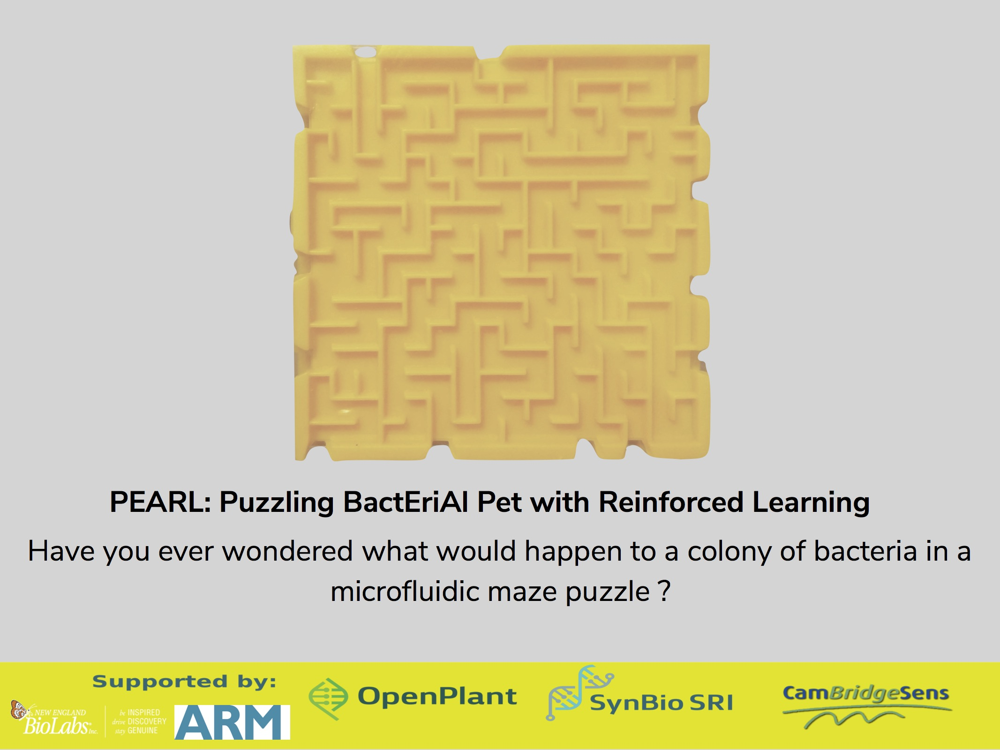

## Synopsis

This proposal is for developing a programmable staging mount, and an imaging platform for a microfluidics based conditioned learning hub for motile bacterial cells. By developing a maze traversal challenge, we aim to create different scenarios for chemotactic bacterial colonies to employ their decision-making machinery and navigate their way out of the maze. By isolating successful colonies and progressing them further to solve more complex mazes, we aim to identify strains of bacteria which are good at solving maze traversing puzzles. The potential learning from this could lead to an understanding of cognition, memory and learning in bacterial colonies. In addition to this, by measuring complexity level of each of the maze designs, we hope to arrive at an understanding of a bacterial colony’s ability to learn from its experience of solving maze traversal puzzles.

## Hardware

Design files for the chip holding base plate and its surrounding support mount can be found in the Hardware folder.

## Installation, Maintenance and Testing Guide

Using the design files in the Hardware folder, you can print the two parts. The chip holding base plate and the surrounding support frame. Once they are printed, the base plate snugly fits into the surrounding base plate.

## License

A short snippet describing the license (MIT, Apache, etc.) you have chosen to use
